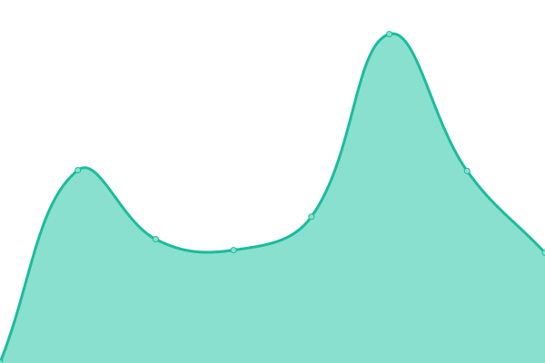
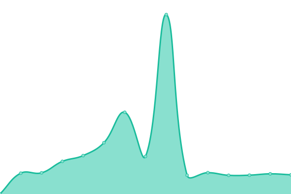
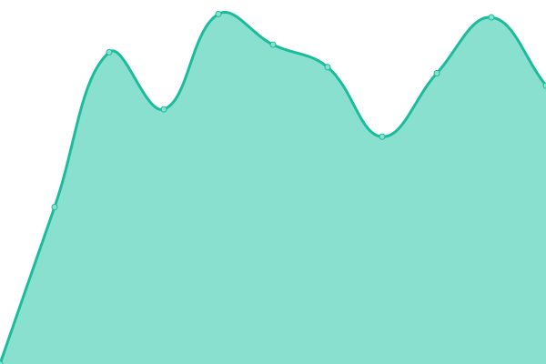

# [📈 Live Status](https://demo.upptime.js.org): <!--live status--> **🟩 All systems operational**

This repository contains the open-source uptime monitor and status page for [Chawarong Songserm](http://chawarong.github.io), powered by [Upptime](https://github.com/upptime/upptime).

With [Upptime](https://upptime.js.org), you can get your own unlimited and free uptime monitor and status page, powered entirely by a GitHub repository. We use [Issues](https://github.com/chawarong/upptime/issues) as incident reports, [Actions](https://github.com/chawarong/upptime/actions) as uptime monitors, and [Pages](https://demo.upptime.js.org) for the status page.

<!--start: status pages-->
<!-- This summary is generated by Upptime (https://github.com/upptime/upptime) -->
<!-- Do not edit this manually, your changes will be overwritten -->
<!-- prettier-ignore -->
| URL | Status | History | Response Time | Uptime |
| --- | ------ | ------- | ------------- | ------ |
|  [CORE Production](https://app.okkami.com) | 🟩 Up | [core-production.yml](https://github.com/fingi/upptime/commits/HEAD/history/core-production.yml) | 

 660ms
     
 | 

<a href="https://fingi.github.io/upptime/history/core-production">100.00%</a>
    

|  [Emenu OKKAMI](https://emenu.okkami.com/) | 🟩 Up | [emenu-okkami.yml](https://github.com/fingi/upptime/commits/HEAD/history/emenu-okkami.yml) | 

 937ms
     
 | 

<a href="https://fingi.github.io/upptime/history/emenu-okkami">100.00%</a>
    

|  [Emenu develop](https://emenu.develop.okkami.com:3443/api/store?puid=000-000-0011&uid=9b1825bb-7839-4266-9efd-9902f9f576f3&k=null&type=Store&language=en) | 🟩 Up | [emenu-develop.yml](https://github.com/fingi/upptime/commits/HEAD/history/emenu-develop.yml) | 

 990ms
     
 | 

<a href="https://fingi.github.io/upptime/history/emenu-develop">100.00%</a>
    

|  [OKKAMI Website](http://www.okkami.com) | 🟩 Up | [okkami-website.yml](https://github.com/fingi/upptime/commits/HEAD/history/okkami-website.yml) | 

 1980ms
     
 | 

<a href="https://fingi.github.io/upptime/history/okkami-website">100.00%</a>
    

<!--end: status pages-->

[**Visit our status website →**](https://demo.upptime.js.org)

## 📄 License

- Powered by: [Upptime](https://github.com/upptime/upptime)
- Code: [MIT](./LICENSE) © [Chawarong Songserm](http://chawarong.github.io)
- Data in the `./history` directory: [Open Database License](https://opendatacommons.org/licenses/odbl/1-0/)
